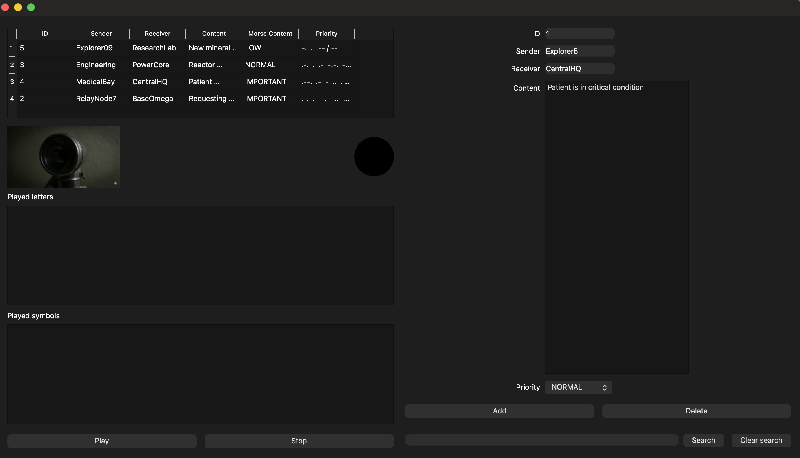
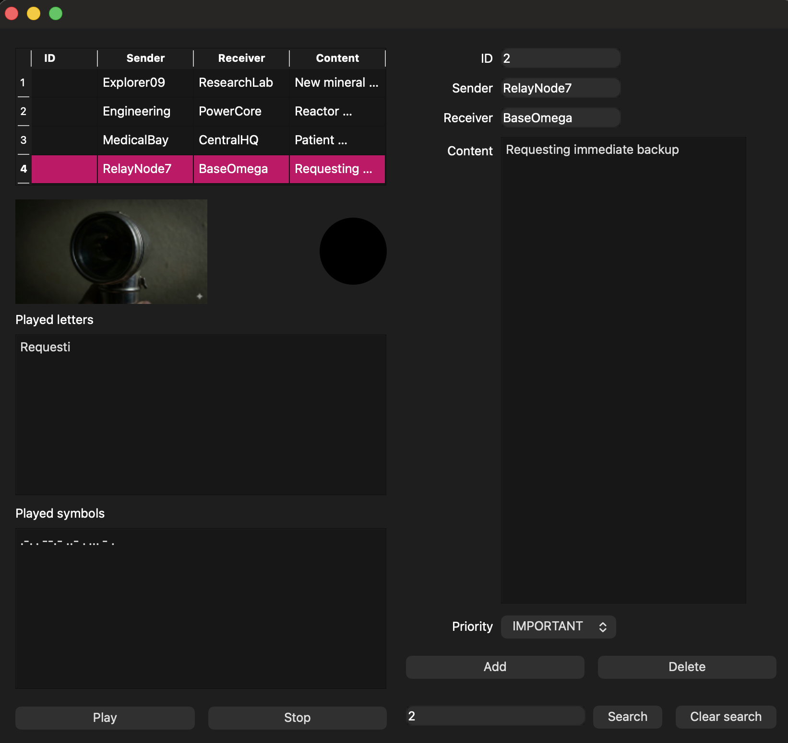

# Morse Code Transmission Logger

## 📌 Overview
The **Transmission Logger** is a comprehensive C++ desktop application built to log, manage, and visually playback radio transmissions in Morse Code. Developed as a capstone project for the Object-Oriented Programming course, it evolves from a robust Command Line Interface (CLI) into a fully interactive Graphical User Interface (GUI) powered by the Qt framework.

## 🚀 Key Features & Architecture
* **Strict Layered Architecture:** The codebase is rigorously divided into Domain, Repository, Service, and Presentation (UI) layers, ensuring a pristine separation of concerns.
* **Advanced Design Patterns Implemented:**
  * **Command Pattern:** Powers a robust Undo/Redo mechanism, storing actions (`AddAction`, `RemoveAction`) in dedicated stacks.
  * **Factory Method Pattern:** Dynamically instantiates the appropriate repository variant at runtime (`CSV` or `JSON`).
  * **Singleton Pattern:** Manages global application settings and configuration states.
* **Data Persistence:** Polymorphic repositories handle reading and writing transmission logs utilizing both standard CSV formats and Qt's JSON parsing libraries (`QJsonDocument`, `QJsonObject`).
* **Interactive Qt GUI:** Features complex layouts, `QTableWidget` data views, global keyboard shortcuts (`QShortcut`), and a custom **Morse Code Visual Player** that uses `QTimer` to accurately simulate Morse code flashes via dynamic image rendering.

## 🛠️ Technologies
* C++ (Standard Template Library)
* Qt Framework (Widgets, Core, GUI)
* JSON Serialization
